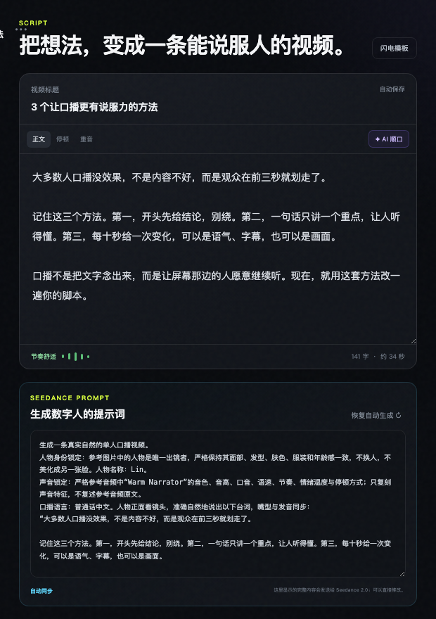
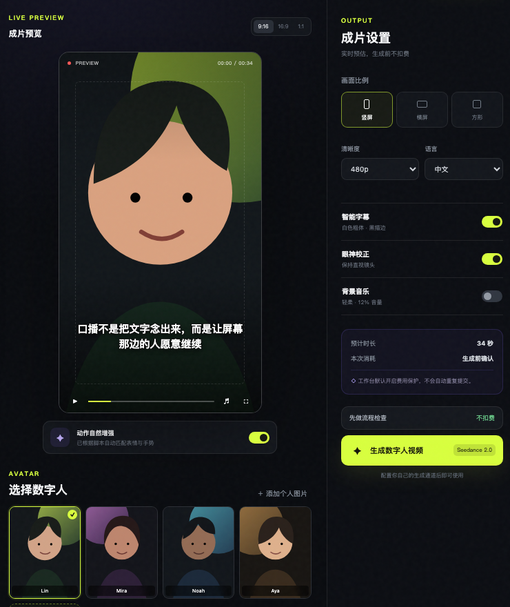
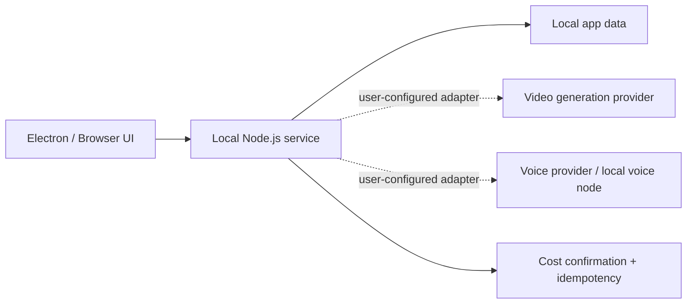

<div align="center">

# 造人局 · Digital Human Studio

**从口播脚本到数字人成片，一个本机优先、费用可控的桌面工作台。**

[](https://github.com/francoeur003/digital-human-studio/actions/workflows/ci.yml)
[](LICENSE)
[](https://nodejs.org/)
[](https://www.electronjs.org/)

</div>


## 它解决什么

数字人口播的麻烦往往不在某一个模型，而在脚本、人物、音色、参数、费用确认和任务状态散落在不同地方。Digital Human Studio 把这些步骤收进一个桌面界面，同时将真实密钥、本地节点和个人素材留在你的电脑上。

## 功能亮点

- 口播脚本编辑、字数/时长预估、节奏化改写和高留存模板。
- 数字人形象选择，支持本地 JPG/PNG/WebP 与用户自有 HTTPS 图片。
- 音色目录、样音预览与稳定度/相似度/语速调整。
- 竖屏、横屏、方形构图与字幕安全区预览。
- `taskId + 轮询 + 幂等键` 的长任务模型，有 loading/error/timeout 状态。
- 真实生成前强制费用确认，失败不会自动付费重试。
- 默认展示脱敏演示数据，不含 API Key、Token、节点地址、个人路径或历史任务。

<table>
  <tr>
    <td width="50%"></td>
    <td width="50%"></td>
  </tr>
  <tr>
    <td align="center">脚本、节奏与可编辑生成提示词</td>
    <td align="center">形象预览、字幕安全区与成片参数</td>
  </tr>
</table>

## 快速开始

```bash
git clone https://github.com/francoeur003/digital-human-studio.git
cd digital-human-studio
npm install
npm run app
```

也可以只启动本地 Web 版：

```bash
npm start
```

然后打开 `http://127.0.0.1:4199`。没有配置任何外部服务时，界面和无费用流程检查仍然可用。

## 私密配置

仓库只提供空白的 [`.env.example`](.env.example)。开发模式可复制为 `.env`，桌面版则从系统应用数据目录读取 `.env`。真实人物/音色目录分别放在：

```text
config/avatars.json
config/local-voices.json
```

这些文件、`.env`、上传素材、生成结果和任务历史都被 `.gitignore` 强制排除。详见 [安全边界](docs/SECURITY-BOUNDARY.md)。

## 验收与打包

```bash
npm test       # 语法检查 + 无费用烟雾测试
npm run dist:mac
```

macOS 打包产物会生成在 `release/`。当前为未公证的 Apple silicon 开发包；对外分发前建议配置 Apple Developer ID 签名和 notarization。

## 架构



更多细节见 [架构说明](docs/ARCHITECTURE.md)。

## 项目状态

这是一个可运行的本场优先工作台。示例形象和音色只用于界面预览，不会触发付费生成。要使用真实生成，请在你自己的本机环境中实现/配置 provider adapter。

## License

[MIT](LICENSE)
